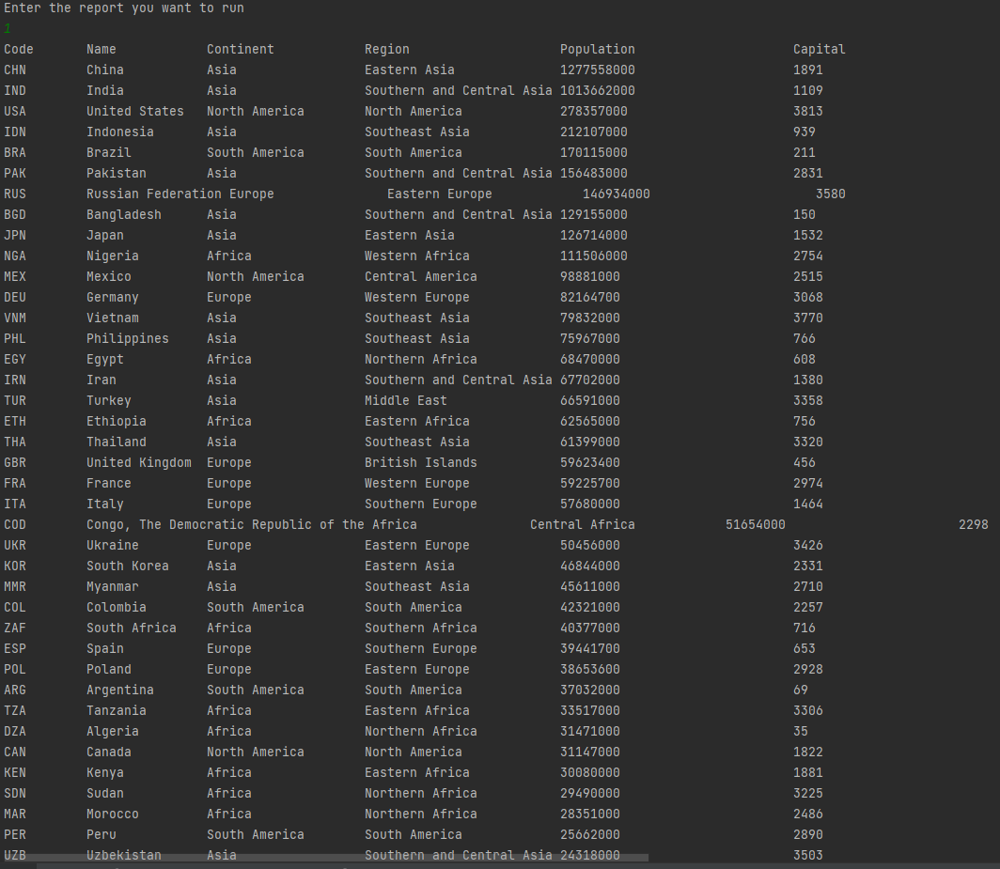
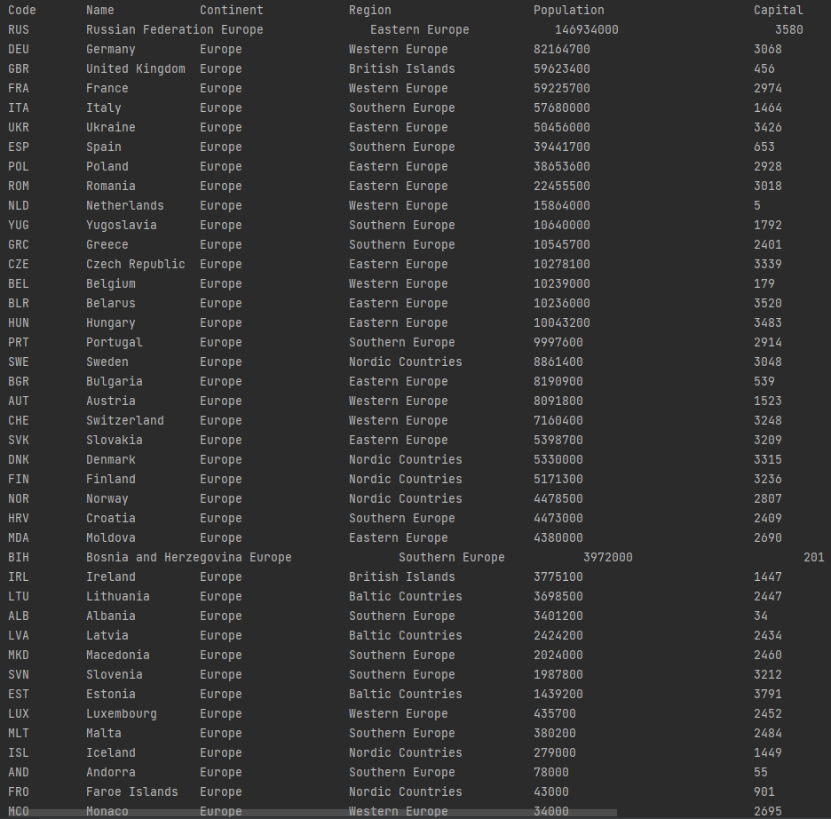
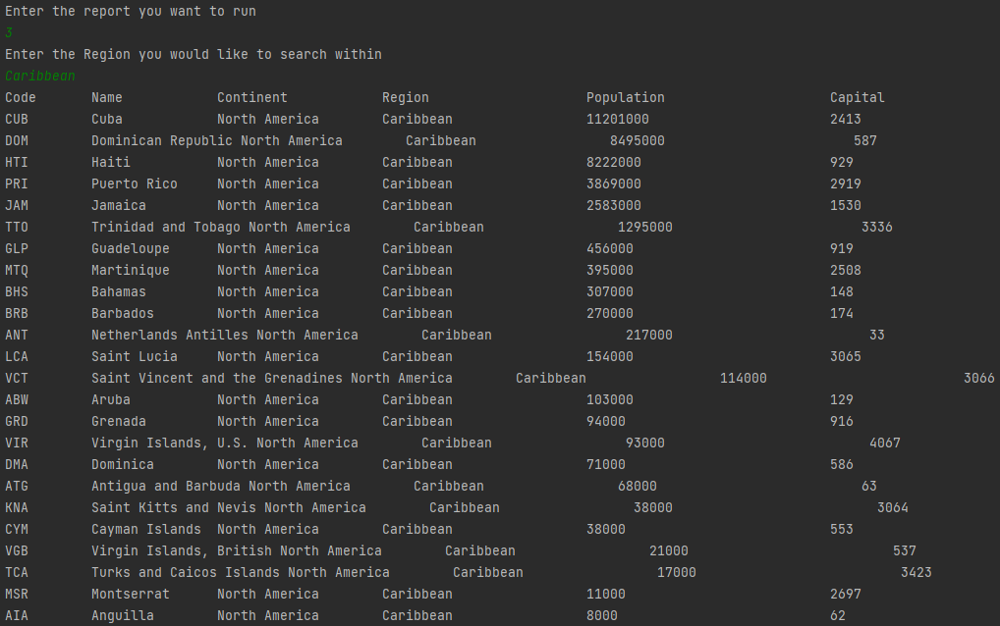
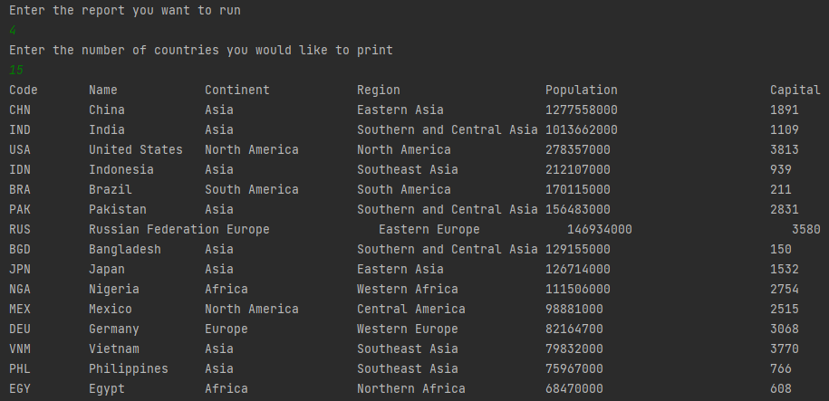
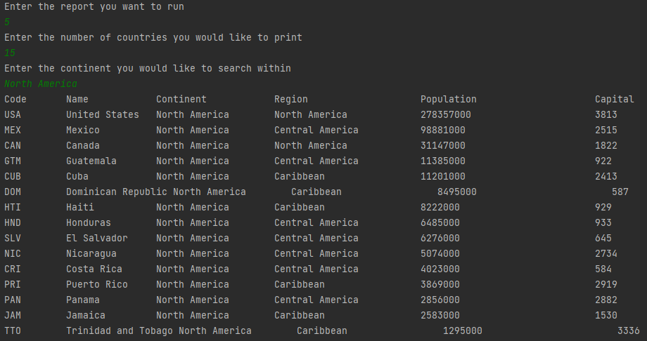
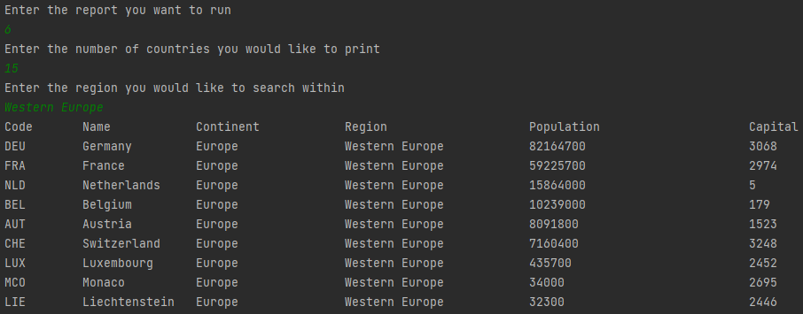
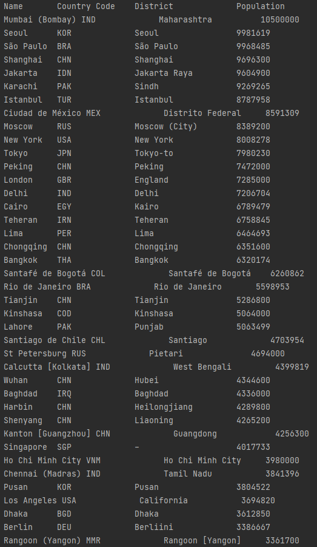
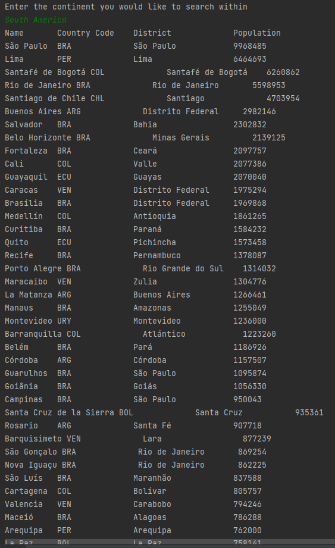
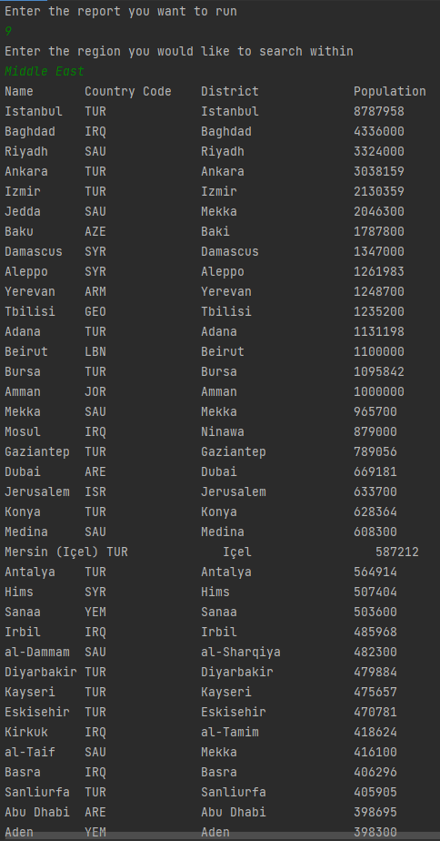
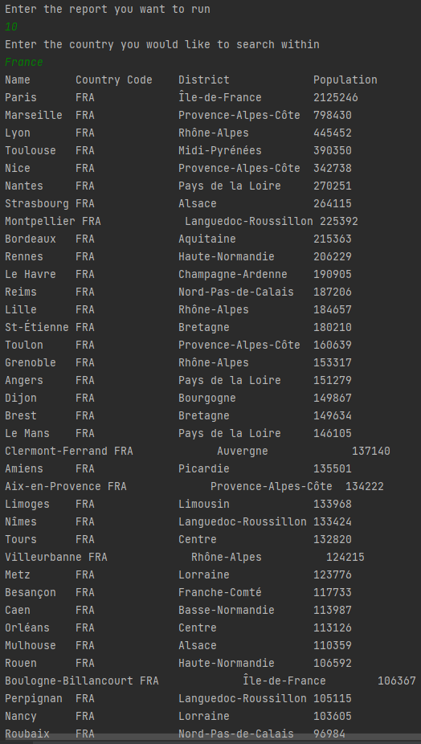

# Group-3

- Master Build Status 
- Develop Build Status 
- Release 
- License 
- Code Coverage 

| ID    | Name | Met  | Screenshot |
|-------|------|------|------------|
| 1     | All the countries in the world organised by largest population to smallest. | Yes |  |
| 2     | All the countries in a continent organised by largest population to smallest. | Yes |  |
| 3     | All the countries in a region organised by largest population to smallest. | Yes |  |
| 4     | The top N populated countries in the world where N is provided by the user. | Yes |  |
| 5     | The top N populated countries in a continent where N is provided by the user. | Yes |  |
| 6     | The top N populated countries in a region where N is provided by the user. | Yes |  |
| 7     | All the cities in the world organised by largest population to smallest. | Yes |  |
| 8     | All the cities in a continent organised by largest population to smallest. | Yes |  |
| 9     | All the cities in a region organised by largest population to smallest. | Yes |  |
| 10     | All the cities in a country organised by largest population to smallest. | Yes |  |